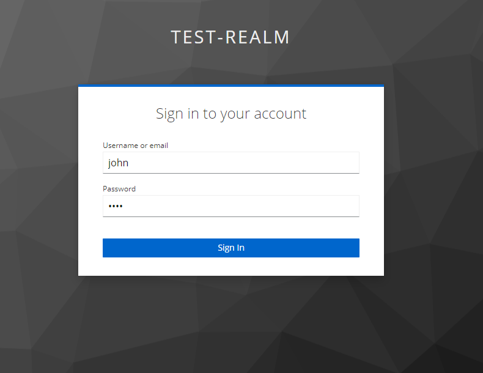

# Keycloak Templating Environment

* Load own templates.


* Edit templates on the fly.


## Usage

* Install Docker on your host machine
* Depending on what web app you prefer run:
   > `docker-compose --profile angular up -d`

   > `docker-compose --profile web-simple up -d`
   
* Alternatively, run it "headless" with `docker compose up -d`. Then hook up your own web app.
* Open [https://localhost:8443](https://localhost:8443) and select `Administration Console`.
* Use `admin` and `password` as credentials.


* In the console select `test-realm`
* Then select `Users` in the sidebar and click `Add user` button to open the form for adding new users

 

* Provide user name, email, first name, last name.
  > The email can be anything as long as it's a valid one.

  > Select `Email verified` to complete the task.


* Create a password under `Credentials`.
> Click `Set password`.
> 
> In the dialog, type in the password two times.
> 
> Deselect option `Temporary` to prevent password change after first login.
>
> Confirm new password.
  


* Now select `master` realm and add an email for your admin user (again, it can be anything, just select `Email verified` afterwards)


  
* Then go to `master` realm's settings and under the tab **Email** set `From` and `Host` fields as shown below:


* To test the *MailDev* settings you can send an email by clicking the button `Test Connection` that is located below `Connection & Authentication`.


* You should see a message like this


* Now open *MailDev* server on http://localhost:1080
> You should see a test email like this:


* Now go to web app and logon as user you setup previously.
> Depending on web app variant this can either be https://localhost:4200 or http://localhost:8080



## Changing themes

* Go to Admin console and select `Realm Settings` of the `test-realm`.
* Select tab `Themes` to change the theme for login forms.
  
  > If your theme doesn't appear in the dropdown list, make sure you copied its folder to the volume `themes` that maps to the folder [themes](./themes/) located in this project.
  ---
  > In the example below I am using the nice `keywind` theme which you can find [on GitHub](https://github.com/lukin/keywind).


* The go back to web app and log off from there. You will be redirected to a new Keycloak theme.


## Adding new themes

As Keycloak is loading themes only once at initial start, we need a mechanism that allows us to introduce new themes without having to restart everything. This is done with the `watcher` container that is polling the status of the docker volume `themes`. Each time we add or remove a folder there, `watcher` will restart the Keycloak instance.


Additionally, Keycloak instances defined in [docker-compose.yml](docker-compose.yml) start with the following flags applied to allow changing UI designs on-the-fly.

```yaml
    - --spi-theme-static-max-age=-1
    - --spi-theme-cache-themes=false
    - --spi-theme-cache-templates=false
```
## Test Realm

The Keycloak instance automatically imports a `test-realm` from [this JSON file](./import/test-realm.json). Feel free to create your own realms but don't forget to make them [visible](https://github.com/brakmic/Keycloak_Templating_Environment/blob/main/docker-compose.yml#L56) to Keycloak. Also take into account that users must be created manually as realm JSONs don't contain user data.

## Docker Containers

The templating environment uses the following services:

* PostgreSQL
* Keycloak
* Web container (Angular or HTML)
* MailDev
* Watcher
* CertSetup
---

> *Notice*: 
> 
> **Postgresql** is controlled by Keycloak and doesn't need any manual configuration. Just leave it as it is.
> 
> **Keycloak** runs in production mode but with caching disabled to make design changes immediately visible.
>
> **Web application cotnainer** can run: 
> * an Angular app
> * or a simple HTML page that executes a [script](./web-app_simple/kc-client.js)
---
> To start Angular app use `--profile angular` when invoking `docker compose`
> 
> The app will look like this:


> To start HTML page use `--profile web-simple` instead.
>
> It will look like this:


> *Hint*:
>  
> If you want to use your own web app then just run `docker compose up -d`
>
> Neither app will be started.
>
> *Notice*: Angular app runs over SSL by default.
>
> To create new TLS certs, check the [HOWTO](./web-app/ssl/HOWTO.md) in `webapp/ssl` folder.

### Watcher

**Watcher** service is used to watch over the `themes` directory and restart Keycloak each time it gets changed.This way one can introduce new themes without needing to restart everything manually.

### MailDev

**MailDev** is a service for mimicking e-mail delivery. This is especially useful when testing Keycloak's `forgot password` functionality.


### CertSetup

**CertSetup** generates certificates and keystores for Keycloak. It stops automatically after successful completion.

---

### Themes

The folder `themes` is a docker volume that can be accessed by Keycloak. To introduce a new theme just copy its folder to this volume. The Watcher will then restart the Keycloak instance to make it available in `Realm Settings`.

## LICENSE
[MIT](./LICENSE)
